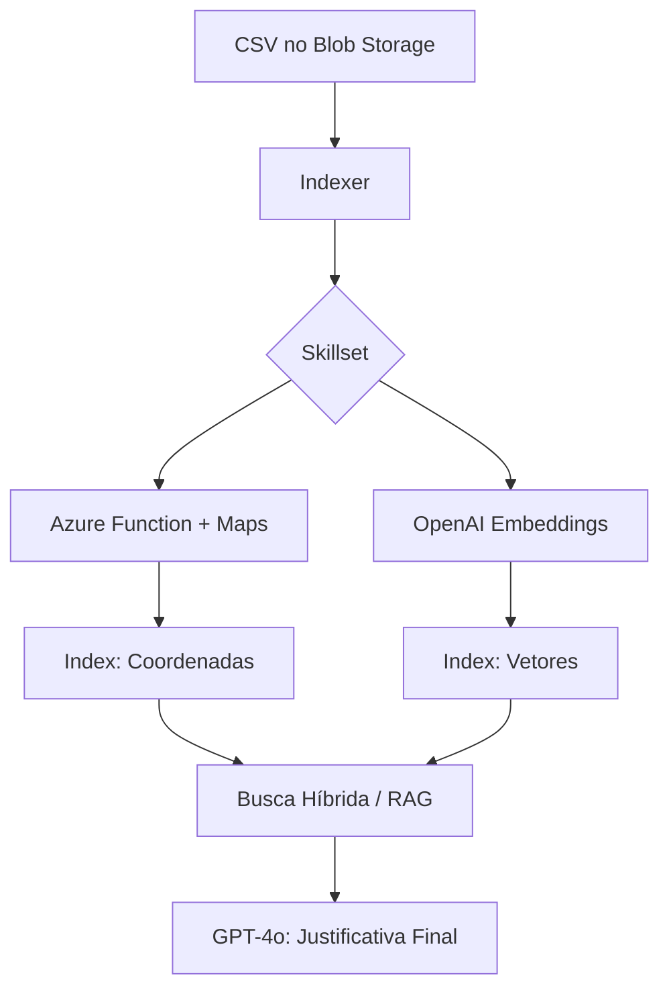

# Azure Smart Staffing RAG 🛡️


Sistema Inteligente de Alocação de Vigilantes utilizando arquitetura **RAG (Retrieval-Augmented Generation)**. O projeto combina busca vetorial, filtros geoespaciais e inteligência generativa para otimizar a logística de substituição de postos de segurança armada.

## 🚀 O Problema e a Solução

A realocação de vigilantes é um desafio crítico que envolve:

1. **Compliance PF:** O profissional precisa estar com a reciclagem em dia.
2. **Logística:** O custo de deslocamento deve ser minimizado.
3. **Fit Comportamental:** O perfil (Soft Skills) deve ser adequado ao tipo de posto (Ex: Escolar vs. Bancário).

Este sistema utiliza **AI Enrichment** para converter endereços brutos em coordenadas e **Vector Embeddings** para analisar perfis comportamentais, entregando ao gestor uma lista de candidatos ideais com justificativas geradas por GPT-4o.

---

## 🏗️ Arquitetura do Sistema

A arquitetura foi desenhada para ser escalável e segura, utilizando o padrão *Identity-First* (sem chaves expostas via **Azure RBAC**).

## A. Fluxo de Dados (Data Pipeline)

1. **Ingestão**: O processo é disparado quando arquivos CSV são depositados no **Azure Blob Storage**.
2. **Enriquecimento via Skillset (AI Pipeline)**:
    * O **Indexer** lê os dados brutos e os submete a um **Skillset** (o motor de transformações).
    * **Custom Skill**: O Skillset orquestra uma chamada para uma **Azure Function**, que integra com o **Azure Maps** para converter CEP em coordenadas geográficas (`Edm.GeographyPoint`).
    * **Embedding Skill**: Em paralelo, o Skillset utiliza o **Azure OpenAI** (`text-embedding-3-small`) para converter as descrições de perfil comportamental em vetores de 1536 dimensões.
3. **Persistência**: O **Indexer** consolida os dados enriquecidos (metadados, coordenadas e vetores) e os persiste no **Azure AI Search**, que atua como nosso **Vector Store** unificado.



## B. Orquestração e Runtime (Kubernetes):
* A aplicação **FastAPI** é executada em **Azure Kubernetes Service (AKS)**, utilizando manifestos de **Deployment** para garantir alta disponibilidade.
* A segurança é garantida via **Workload Identity**, permitindo que o Pod se autentique nos serviços de IA sem chaves de API (Secretless Architecture). 

## C. Processo RAG Inteligente (LangChain):
* O **LangChain** atua como o motor de orquestração:
* **Retrieval:** Realiza a **Busca Híbrida** no AI Search aplicando: 
    * **Filtros OData:** Para compliance de reciclagem.
    * **Geo-filtering:** Para proximidade geográfica.
    * **Vector Search:** Para similaridade semântica de Soft Skills.
* **Augmentation:** Monta um prompt contextualizado injetando o perfil dos candidatos encontrados.
* **Generation:** O **GPT-4o** gera uma justificativa humanizada, comparando as Soft Skills do colaborador com os requisitos do posto (ex: "Perfil comunicativo ideal para posto escolar").

---

## 🛠️ Stack Tecnológica

* **Linguagem:** Python 3.11+
* **Framework:** FastAPI & LangChain
* **IA Generativa:** Azure OpenAI (GPT-4o & Text-Embeddings)
* **Busca Inteligente**: Azure AI Search (Hybrid Search, Skillsets & Scoring Profiles)
* **Infraestrutura:** Terraform (Modular Design) & Kubernetes (AKS)
* **Segurança:** Azure RBAC (Managed Identities) & Private Endpoints
* **CI/CD:** GitHub Actions
* **Dados:** Azure Blob Storage & Azure Functions (Event-Driven Ingestion)

---

## 🗺️ Roadmap de Desenvolvimento

### 1. Criação do Dataset

* [x] **Setup de Gerador Sintético:** Script Python utilizando biblioteca `Faker` para criação de massa de dados.
* [x] **Compliance LGPD (Data Masking):** Implementação de máscara em campos sensíveis (CPF: `785.***.***-30`) para proteção de PII.
* [x] **Dicionário de Dados:** Definição de atributos críticos (Certificações, Reciclagem PF, Soft Skills e CEP).
* [x] **Cenários de Teste:** Geração de arquivos `base_vigilantes_ativos.csv` e `escala_atual.csv`.

### 2. Infraestrutura como Código (Terraform Modular)

* [x] **Setup de Provedores:** Configuração do Azure Provider e Backend Remoto para `.tfstate`.
* [x] **Módulo de Cluster:** Provisionamento do **Azure Kubernetes Service (AKS)** e Container Registry (ACR).
* [x] **Módulo de Storage:** Provisionamento de Blob Storage e Containers de Ingestão (`rh-uploads`).
* [x] **Módulo de IA:** Deployment do Azure OpenAI e Azure AI Search (SKU Standard).
* [x] **Módulo de Networking:** Configuração de VNet e isolamento de rede.
* [x] **Segurança RBAC:** Atribuição de roles (`Cognitive Services User`, `Search Index Data Contributor`).
* [x] **Módulo de Serverless:** Provisionamento de **Azure Functions** para pipeline de enriquecimento.

### 3. Ingestão e Enriquecimento (AI Pipeline)

* [x] **Azure Function (Custom Skill):** Desenvolvimento de API Serverless para geocodificação (CEP -> Lat/Long) seguindo o contrato de interface do AI Search.
* [x] **AI Search Skillset:** Configuração do pipeline de enriquecimento que orquestra a chamada da Function e a extração de metadados.
* [x] **Index Design (Geospatial & Vector):** Configuração de campos `Edm.GeographyPoint` para busca por proximidade e `Collection(Single)` para busca vetorial de Soft Skills.
* [x] **Indexer & DataSource:** Automação da varredura do Blob Storage (`rh-uploads`) para sincronização e vetorização automática de novos perfis.

### 4. Engine RAG & API (Fase Atual 🚧) 
* [ ] **Containerização:** Dockerfile multi-stage.
* [ ] **Kubernetes Manifests:** Deployments, Services e ServiceAccounts para Workload Identity.
* [x] **Retrieval Strategy:** Implementação de Busca Híbrida e Re-ranking semântico.
* [x] **FastAPI Endpoints:** Interface para solicitação de substituição.

### 5. Automação, DevOps & Observabilidade
* [ ] **CI/CD Pipeline:** Automação via GitHub Actions (Lint, Build, Push, Deploy).
* [ ] **Observabilidade:** Integração com **Application Insights** para monitoramento de traces de IA. 

---

## 🛠️ Guia de Configuração da Infraestrutura (Início Rápido)

Este guia detalha como subir toda a infraestrutura na Azure utilizando Terraform.

### 1. Pré-requisitos
* **Azure CLI** instalado e logado (`az login`).
* **Terraform** (v1.0+) instalado.
* **Azure Functions Core Tools** instalado (para deploy/teste da Custom Skill).
* **Docker Desktop** rodando.
* **Assinatura Azure** ativa.
* **Python 3.11+** configurado.

### 2. Passo a Passo Inicial

#### A. Bootstrap (Preparação do Cofre)
O Terraform precisa de um lugar seguro para guardar o estado da sua infraestrutura. Execute o script de automação inicial:

```bash
chmod +x bootstrap.sh
./bootstrap.sh
```

*Este script criará um Resource Group chamado `rg-terraform-state`. **Anote o nome da Storage Account gerada no final.***

#### B. Configuração do Backend 
Abra o arquivo `terraform/main.tf` e atualize o bloco `backend "azurerm"` com o nome da Storage Account gerada:

```hcl
backend "azurerm" {
  resource_group_name  = "rg-terraform-state"
  storage_account_name = "ST_GERADA_AQUI"
  container_name       = "tfstate"
  key                  = "smart-staffing.terraform.tfstate"
}
```

#### C. Provisionamento (Deploy)
Agora, dispare a criação de todos os recursos:

```bash
cd terraform
terraform init
terraform plan
terraform apply -auto-approve
```


## 🛠️ Guia de Execução Local

#### 1. Deploy da Custom Skill (Azure Function)

O Azure AI Search depende desta função para enriquecer os dados, esteja na raiz do projeto.

```bash
cd azure_functions/geocoding
func azure functionapp publish func-enrich-data-smart-staffing

```

### 2. Extração de Credenciais (Pós-Deploy)

Após o `terraform apply` e a criação da **Azure Function**, execute o script em shell com os comandos abaixo, é necessário estar na raiz do projeto:

```bash
chmod +x setup-env.sh
# Precisa ser executado com o comando source para funcionar corretamente
source setup-env.sh 
```

### 3. Geração da Massa de Dados

Esteja na raiz do projeto.

```bash
python -m venv venv
source venv/bin/activate  # venv\Scripts\activate no Windows
pip install -r requirements.txt
python scripts/data_generator.py
```

### 4. Sincronização do AI Search Pipeline

Com a infraestrutura pronta e as variáveis configuradas, rode o script de sincronização para criar o Índice, o Skillset e o Indexador:

```bash
# Sincroniza as definições JSON locais com a Azure
python scripts/sync_search.py
```

### 5. Upload da Massa de Dados

Esteja na raiz do projeto. O script envia diretamente para o container de ingestão que o Indexador monitora.

```bash
# Upload para o Azure Blob Storage (Usando a Connection String do setup-env)
az storage blob upload --container-name "rh-uploads" --file "base_vigilantes_ativos.csv" --name "base_vigilantes_ativos.csv" --connection-string "$AZURE_STORAGE_CONNECTION_STRING" --overwrite
```

### 6. Monitoramento da Indexação (Obrigatório) 🔍

O **Azure AI Search** está programado para ler a cada 5 minutos mudanças no **Azure Blob Storage**.

O processo de indexação consome os dados do Blob Storage, chama a **Azure Function** para Geocoding (CEP → Lat/Lon) e o **Azure OpenAI** para Embeddings (Vetorização das Soft Skills). 

Como o ambiente utiliza **RBAC (Role-Based Access Control)** para máxima segurança, as chaves administrativas estão desativadas. Use o script de automação para garantir as permissões e validar o status:

```bash
# 1. Dê permissão de execução ao script
chmod +x ./verify_search_data.sh

# 2. Execute o monitoramento
./verify_search_data.sh
```

**O que o script faz por você:**
1.  **Atribuição Automática:** Identifica seu usuário logado e concede o papel `Search Index Data Reader`.
2.  **Propagação de Segurança:** Aguarda os **2 minutos** necessários para o Azure atualizar as regras de acesso.
3.  **Validação em Tempo Real:** Gera um token de identidade (Bearer) e consulta o índice via API REST.

> **Status de Sucesso:** O processo estará concluído quando o campo `"@odata.count"` (ou `itemsProcessed`) for igual ao número de linhas do seu CSV (ex: 400) e o status for `success`.


Entendido. O problema do `ModuleNotFoundError` acontece porque o binário do `uvicorn` do Anaconda está atravessando o seu `venv`. Usar `python -m uvicorn` resolve isso na hora.

Aqui está o **Passo 7** refatorado para o seu `README.md`, focando na experiência do usuário com o **Postman**, que é muito mais visual para ver a justificativa da IA.

### 7. Inicialização da API e Teste de Alocação (RAG) 🚀

Com os dados indexados e enriquecidos, agora você pode rodar o motor de busca híbrida e geração de justificativas.

#### A. Rodar o Servidor FastAPI
Certifique-se de estar na raiz do projeto e com o ambiente virtual ativo. Utilize o prefixo `python -m` para garantir que o Uvicorn utilize as dependências do seu `venv` e não do Python global/Anaconda.

```bash
# Ative o ambiente (se ainda não estiver)
source venv/bin/activate 

# Inicie a API
python -m uvicorn app.main:app --reload --port 8000
```

#### B. Teste de Fluxo via Postman
Para validar o sistema, simule uma falta de um vigilante e peça para a IA encontrar o melhor substituto.

1.  **Abra o Postman** e crie uma nova requisição **POST**.
2.  **URL:** `http://localhost:8000/v1/find-replacement`
3.  **Headers:** Adicione `Content-Type: application/json`.
4.  **Body (raw JSON):**
    ```json
    {
      "nome": "NOME_DE_UM_VIGILANTE_DO_CSV",
      "perfil_extra": "Preciso de um perfil extremamente calmo e vigilante para posto em maternidade, com foco em atendimento humanizado."
    }
    ```
    *(Dica: Pegue qualquer nome da coluna `nome_completo` do seu arquivo `base_vigilantes_ativos.csv` para testar).*

#### C. Entendendo o Retorno
A API retornará um objeto contendo:
* **`faltante`**: Confirmação do colaborador que está sendo substituído.
* **`ranking_proximidade`**: Uma lista dos nomes encontrados num raio de 30km, ordenados por distância e relevância técnica.
* **`decisao_do_coordenador_ia`**: A justificativa gerada pelo **GPT-4o**, comparando o perfil dos candidatos com o `perfil_extra` solicitado.


#### D. Exemplo Real de Uso (RAG em Ação)

Para entender o poder da solução, veja este cenário real processado pelo sistema:

**1. Requisição (O que o Coordenador pede):**
```json
{
  "nome": "Francisco Barros",
  "perfil_extra": "Preciso de um perfil extremamente calmo e vigilante para posto em maternidade, com foco em atendimento humanizado."
}
```

**2. Resposta da API (O que a IA decide):**
```json
{
    "status": "Processado com Sucesso",
    "faltante": "Francisco Barros",
    "decisao_do_coordenador_ia": "Para o posto na maternidade, onde é essencial um perfil extremamente calmo e focado em atendimento humanizado, o melhor candidato é o Dr. Benjamin Brito. \n\nJustificativa:\n- Nota mais alta (9.9), indicando alto desempenho.\n- Skills de empatia e inteligência emocional são cruciais para atendimento humanizado.\n- Experiência e certificações adequadas para o posto.\n- Demonstra facilidade em lidar com público diverso, essencial para o ambiente de maternidade.",
    "ranking_proximidade": [
        "Isabelly Silveira",
        "Dr. Bryan Ramos",
        "Maria Fernanda Moraes",
        "Dr. Benjamin Brito",
        "João Azevedo"
    ]
}
```

> **Nota Técnica:** Observe que o `ranking_proximidade` listou os vizinhos geográficos, mas a `decisao_do_coordenador_ia` foi capaz de filtrar e escolher o **Dr. Benjamin Brito** baseado no cruzamento vetorial das *Soft Skills* (Empatia/Inteligência Emocional) com a necessidade do posto (Maternidade), mesmo ele não sendo o primeiro da lista de distância.

---

## 🔐 Segurança e Compliance

* **Zero Trust:** Comunicação entre AKS, Functions e Serviços de IA via **Managed Identities**.
* **Isolamento:** Uso de Private Endpoints para garantir que o tráfego de dados não transite pela internet pública.
* **LGPD:** Mascaramento de dados sensíveis na camada de geração de dataset sintético.

---

## 📁 Estrutura do Repositório (Falta atualizar isso)

```text
├── terraform/            # Módulos de Infraestrutura
├── azure_functions/      # Custom Skills (Geocoding)
├── scripts/              # Sync Scripts e Gerador de Dados
├── search_assets/        # Definições JSON (Index, Skillset, Indexer)
├── app/                  # Engine RAG (FastAPI + LangChain)
└── README.md
```
