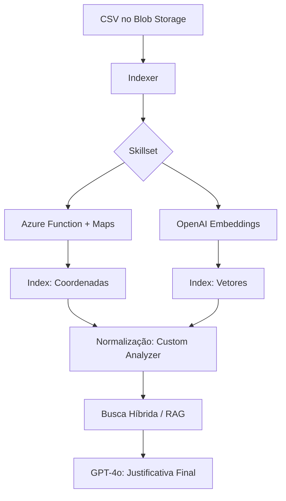

# Azure Smart Staffing RAG 🛡️


Sistema Inteligente de Alocação de Vigilantes utilizando arquitetura **RAG (Retrieval-Augmented Generation)**. O projeto combina busca vetorial, filtros geoespaciais e inteligência generativa para otimizar a logística de substituição de postos de segurança armada.

## 🚀 O Problema e a Solução

A realocação de vigilantes é um desafio crítico que envolve:

1. **Compliance PF:** O profissional precisa estar com a reciclagem em dia.
2. **Logística:** O custo de deslocamento deve ser minimizado.
3. **Fit Comportamental:** O perfil (Soft Skills) deve ser adequado ao tipo de posto (Ex: Escolar vs. Bancário).

Este sistema utiliza **AI Enrichment** para converter endereços brutos em coordenadas e **Vector Embeddings** para analisar perfis comportamentais, entregando ao gestor uma lista de candidatos ideais com justificativas geradas por GPT-4o.

---

## 🏗️ Arquitetura do Sistema

A arquitetura foi desenhada para ser escalável e segura, utilizando o padrão *Identity-First* (sem chaves expostas via **Azure RBAC**).

### A. Fluxo de Dados (Data Pipeline)

O pipeline de dados é totalmente orientado a eventos e automatizado, garantindo que qualquer novo vigilante cadastrado no RH seja vetorizado e geolocalizado em minutos.

1.  **Ingestão**: O processo é disparado quando arquivos CSV são depositados no **Azure Blob Storage**.
2.  **Enriquecimento via Skillset (AI Pipeline)**:
    * O **Indexer** extrai os dados brutos e os submete a um **Skillset** (o motor de transformações cognitivas).
    * **Custom Skill (Geocoding)**: O Skillset orquestra uma chamada para uma **Azure Function**, que consome o **Azure Maps API** para converter o campo `cep_base` em coordenadas geográficas reais (`Edm.GeographyPoint`).
    * **Embedding Skill**: Simultaneamente, o Skillset utiliza o **Azure OpenAI** (`text-embedding-3-small`) para converter as descrições do `perfil_comportamental` em vetores de 1536 dimensões, permitindo buscas por similaridade semântica.
3.  **Normalização e Indexação**:
    * **Custom Analyzer**: Durante a indexação, aplicamos um analisador customizado no campo `nome_completo`. Utilizando os filtros `lowercase` e `asciifolding`, o sistema normaliza nomes com acentuação (ex: `Maitê` vira `maite`), garantindo que a busca por texto seja resiliente a erros de digitação e variações regionais.
4.  **Persistência**: O **Indexer** consolida os metadados, coordenadas e vetores, persistindo-os no **Azure AI Search**, que atua como nosso **Vector Store** e motor de busca geoespacial unificado.



## B. Orquestração e Runtime (Kubernetes):
* A aplicação **FastAPI** é executada em **Azure Kubernetes Service (AKS)**, utilizando manifestos de **Deployment** para garantir alta disponibilidade.
* A segurança é garantida via **Workload Identity**, permitindo que o Pod se autentique nos serviços de IA sem chaves de API (Secretless Architecture). 

## C. Processo RAG Inteligente (LangChain):
* O **LangChain** atua como o motor de orquestração:
* **Retrieval:** Realiza a **Busca Híbrida** no AI Search aplicando: 
    * **Filtros OData:** Para compliance de reciclagem.
    * **Geo-filtering:** Para proximidade geográfica.
    * **Vector Search:** Para similaridade semântica de Soft Skills.
* **Augmentation:** Monta um prompt contextualizado injetando o perfil dos candidatos encontrados.
* **Generation:** O **GPT-4o** gera uma justificativa humanizada, comparando as Soft Skills do colaborador com os requisitos do posto (ex: "Perfil comunicativo ideal para posto escolar").

### D. Resiliência e Validação de Identidade (Fuzzy Match)
Para evitar falhas na identificação do vigilante faltante (ex: `Maitê` vs `Maite`) e impedir falsos positivos (ex: buscar `Ue da Silva` e o sistema trazer `Dante Silva`), implementei uma camada de validação híbrida no `retriever.py`:

* **Normalização ASCII:** Limpeza de títulos (`Sr.`, `Dra.`), remoção de acentos e padronização de case.
* **Algoritmo de Similaridade (Gestalt Pattern Matching):** Utilizei a biblioteca `difflib` para calcular o ratio de semelhança entre a entrada do usuário e o retorno do banco.
* **Threshold de Segurança:** Defini um corte de **0.8 (80%)**. Se o Azure Search sugerir um nome com similaridade inferior a essa, o sistema bloqueia o match e retorna `404 Not Found`, garantindo que a IA não gere justificativas baseadas em colaboradores errados.

---

## 🛠️ Stack Tecnológica (Revisada)

* **Linguagem:** Python 3.11+
* **Framework:** FastAPI & LangChain (Orquestração RAG)
* **Qualidade de Código:** Pytest 
* **IA Generativa:** Azure OpenAI (**GPT-4o** para decisão & **text-embedding-3-small** para busca semântica)
* **Busca Inteligente:** Azure AI Search (**Hybrid Search**, **Vector Store**, **Custom Analyzers** com *ASCII Folding* e filtros **OData**)
* **Resiliência de Dados:** Processamento de similaridade de strings com `difflib` (**Gestalt Pattern Matching**) e normalização Unicode.
* **Infraestrutura:** Terraform (Modular/IaC) & Kubernetes (AKS com **Horizontal Pod Autoscaling**)
* **Segurança:** Azure RBAC (**Managed Identities / Workload Identity** para arquitetura *Secretless*) & Private Endpoints
* **CI/CD:** GitHub Actions (Build, Push e Rollout automatizados)
* **Dados:** Azure Blob Storage & Azure Functions (Geocoding via **Azure Maps API**)

---

## 🗺️ Roadmap de Desenvolvimento

### 1. Criação do Dataset

* [x] **Setup de Gerador Sintético:** Script Python utilizando biblioteca `Faker` para criação de massa de dados.
* [x] **Compliance LGPD (Data Masking):** Implementação de máscara em campos sensíveis (CPF: `785.***.***-30`) para proteção de PII.
* [x] **Dicionário de Dados:** Definição de atributos críticos (Certificações, Reciclagem PF, Soft Skills e CEP).
* [x] **Cenários de Teste:** Geração de arquivo `base_vigilantes_ativos.csv`.

### 2. Infraestrutura como Código (Terraform Modular)

* [x] **Setup de Provedores:** Configuração do Azure Provider e Backend Remoto para `.tfstate`.
* [x] **Módulo de Cluster:** Provisionamento do **Azure Kubernetes Service (AKS)** e Container Registry (ACR).
* [x] **Módulo de Storage:** Provisionamento de Blob Storage e Containers de Ingestão (`rh-uploads`).
* [x] **Módulo de IA:** Deployment do Azure OpenAI e Azure AI Search (SKU Standard).
* [x] **Módulo de Networking:** Configuração de VNet e isolamento de rede.
* [x] **Segurança RBAC:** Atribuição de roles (`Cognitive Services User`, `Search Index Data Contributor`).
* [x] **Módulo de Serverless:** Provisionamento de **Azure Functions** para pipeline de enriquecimento.

### 3. Ingestão e Enriquecimento (AI Pipeline)

* [x] **Azure Function (Custom Skill):** Desenvolvimento de API Serverless para geocodificação (CEP -> Lat/Long) seguindo o contrato de interface do AI Search.
* [x] **AI Search Skillset:** Configuração do pipeline de enriquecimento que orquestra a chamada da Function e a extração de metadados.
* [x] **Index Design (Geospatial & Vector):** Configuração de campos `Edm.GeographyPoint` para busca por proximidade e `Collection(Single)` para busca vetorial de Soft Skills.
* [x] **Indexer & DataSource:** Automação da varredura do Blob Storage (`rh-uploads`) para sincronização e vetorização automática de novos perfis.

### 4. Engine RAG & API
* [x] **Retrieval Strategy:** Busca Híbrida e Re-ranking semântico.
* [x] **Resiliência de Busca:** Validação Fuzzy e normalização ASCII.
* [x] **FastAPI Endpoints:** Interface para solicitação de substituição.
* [x] **Containerização:** Dockerfile multi-stage.
* [x] **Kubernetes Manifests:** Deployments, Services e ServiceAccounts para Workload Identity.

### 5. Automação & DevOps (CI/CD Profissional)
* [x] **Infraestrutura como Código (IaC):** Provisionamento automatizado com Terraform e State remoto.
* [x] **Pipeline de Auto-Discovery:** Captura dinâmica de segredos e endpoints (Service Discovery) via Azure CLI.
* [x] **QA & CI:** Execução de testes unitários com Pytest e Build de imagens Docker multi-estágio.
* [x] **AI Search Sync:** Sincronização automatizada de Índices, Skillsets e Indexadores.
* [x] **Serverless Deploy:** Deployment automatizado do código das Azure Functions (Geocoding API).
* [x] **GitOps no AKS:** Deploy automatizado em Kubernetes com injeção de variáveis via `envsubst`.


---

## 🛠️ Guia de Configuração da Infraestrutura (Início Rápido)

Este guia detalha como subir toda a infraestrutura na Azure utilizando Terraform.

### 1. Pré-requisitos
* **Azure CLI** instalado e logado (`az login`).
* **Terraform** (v1.0+) instalado.
* **Azure Functions Core Tools** instalado (para deploy/teste da Custom Skill).
* **Docker Desktop** rodando.
* **Assinatura Azure** ativa.
* **Python 3.11+** configurado.

### 2. Passo a Passo Inicial

#### A. Bootstrap (Preparação do Cofre)
O Terraform precisa de um lugar seguro para guardar o estado da sua infraestrutura. Execute o script de automação inicial:

```bash
chmod +x bootstrap.sh
./bootstrap.sh
```

*Este script criará um Resource Group chamado `rg-terraform-state`. **Anote o nome da Storage Account gerada no final.***

#### B. Configuração do Backend 
Abra o arquivo `terraform/main.tf` e atualize o bloco `backend "azurerm"` com o nome da Storage Account gerada:

```hcl
backend "azurerm" {
  resource_group_name  = "rg-terraform-state"
  storage_account_name = "ST_GERADA_AQUI"
  container_name       = "tfstate"
  key                  = "smart-staffing.terraform.tfstate"
}
```

#### C. Provisionamento (Deploy)
Agora, dispare a criação de todos os recursos:

```bash
cd terraform
terraform init
terraform plan
terraform apply -auto-approve
```


## 🛠️ Guia de Execução Local

#### 1. Deploy da Custom Skill (Azure Function)

O Azure AI Search depende desta função para enriquecer os dados, esteja na raiz do projeto.

```bash
cd azure_functions/geocoding
func azure functionapp publish func-enrich-data-smart-staffing

```

### 2. Extração de Credenciais (Pós-Deploy)

Após o `terraform apply` e a criação da **Azure Function**, execute o script em shell com os comandos abaixo, é necessário estar na raiz do projeto:

```bash
chmod +x setup-env.sh
# Precisa ser executado com o comando source para funcionar corretamente
source setup-env.sh 
```

### 3. Geração da Massa de Dados

Esteja na raiz do projeto.

```bash
python -m venv venv
source venv/bin/activate  # venv\Scripts\activate no Windows
pip install -r requirements.txt
python scripts/data_generator.py
```

### 4. Sincronização do AI Search Pipeline

Com a infraestrutura pronta e as variáveis configuradas, rode o script de sincronização para criar o Índice, o Skillset e o Indexador:

```bash
# Sincroniza as definições JSON locais com a Azure
python scripts/sync_search.py
```

### 5. Upload da Massa de Dados

Esteja na raiz do projeto. O script envia diretamente para o container de ingestão que o Indexador monitora.

```bash
# Upload para o Azure Blob Storage (Usando a Connection String do setup-env)
az storage blob upload --container-name "rh-uploads" --file "base_vigilantes_ativos.csv" --name "base_vigilantes_ativos.csv" --connection-string "$AZURE_STORAGE_CONNECTION_STRING" --overwrite
```

### 6. Monitoramento da Indexação (Obrigatório) 🔍

O **Azure AI Search** está programado para ler a cada 5 minutos mudanças no **Azure Blob Storage**.

O processo de indexação consome os dados do Blob Storage, chama a **Azure Function** para Geocoding (CEP → Lat/Lon) e o **Azure OpenAI** para Embeddings (Vetorização das Soft Skills). 

Como o ambiente utiliza **RBAC (Role-Based Access Control)** para máxima segurança, as chaves administrativas estão desativadas. Use o script de automação para garantir as permissões e validar o status:

```bash
# 1. Dê permissão de execução ao script
chmod +x ./verify_search_data.sh

# 2. Execute o monitoramento
./verify_search_data.sh
```

**O que o script faz por você:**
1.  **Atribuição Automática:** Identifica seu usuário logado e concede o papel `Search Index Data Reader`.
2.  **Propagação de Segurança:** Aguarda os **2 minutos** necessários para o Azure atualizar as regras de acesso.
3.  **Validação em Tempo Real:** Gera um token de identidade (Bearer) e consulta o índice via API REST.

> **Status de Sucesso:** O processo estará concluído quando o campo `"@odata.count"` (ou `itemsProcessed`) for igual ao número de linhas do seu CSV (ex: 400) e o status for `success`.


### 7. Inicialização da API e Teste de Alocação (RAG) 🚀

Com os dados indexados e enriquecidos, agora você pode rodar o motor de busca híbrida e geração de justificativas.

#### A. Rodar o Servidor FastAPI
Certifique-se de estar na raiz do projeto e com o ambiente virtual ativo. Utilize o prefixo `python -m` para garantir que o Uvicorn utilize as dependências do seu `venv` e não do Python global/Anaconda.

```bash
# Ative o ambiente (se ainda não estiver)
source venv/bin/activate 

# Execute os testes via módulo python (evita conflitos de PATH/Anaconda)
python -m pytest

# Inicie a API
python -m uvicorn app.main:app --reload --port 8000
```

#### B. Teste de Fluxo via Postman
Para validar o sistema, simule uma falta de um vigilante e peça para a IA encontrar o melhor substituto.

1.  **Abra o Postman** e crie uma nova requisição **POST**.
2.  **URL:** `http://localhost:8000/v1/find-replacement`
3.  **Headers:** Adicione `Content-Type: application/json`.
4.  **Body (raw JSON):**
    ```json
    {
      "nome": "NOME_DE_UM_VIGILANTE_DO_CSV",
      "perfil_extra": "Preciso de um perfil extremamente calmo e vigilante para posto em maternidade, com foco em atendimento humanizado."
    }
    ```
    *(Dica: Pegue qualquer nome da coluna `nome_completo` do seu arquivo `base_vigilantes_ativos.csv` para testar).*

#### C. Entendendo o Retorno
A API retornará um objeto contendo:
* **`faltante`**: Confirmação do colaborador que está sendo substituído.
* **`ranking_proximidade`**: Uma lista dos nomes encontrados num raio de 30km, ordenados por distância e relevância técnica.
* **`decisao_do_coordenador_ia`**: A justificativa gerada pelo **GPT-4o**, comparando o perfil dos candidatos com o `perfil_extra` solicitado.


#### D. Exemplo Real de Uso (RAG em Ação)

Para entender o poder da solução, veja este cenário real processado pelo sistema:

**Requisição (O que o Coordenador pede):**
```json
{
  "nome": "Francisco Barros",
  "perfil_extra": "Preciso de um perfil extremamente calmo e vigilante para posto em maternidade, com foco em atendimento humanizado."
}
```

**Resposta da API (O que a IA decide):**
```json
{
    "status": "Processado com Sucesso",
    "faltante": "Francisco Barros",
    "decisao_do_coordenador_ia": "Para o posto na maternidade, onde é essencial um perfil extremamente calmo e focado em atendimento humanizado, o melhor candidato é o Dr. Benjamin Brito. \n\nJustificativa:\n- Nota mais alta (9.9), indicando alto desempenho.\n- Skills de empatia e inteligência emocional são cruciais para atendimento humanizado.\n- Experiência e certificações adequadas para o posto.\n- Demonstra facilidade em lidar com público diverso, essencial para o ambiente de maternidade.",
    "ranking_proximidade": [
        "Isabelly Silveira",
        "Dr. Bryan Ramos",
        "Maria Fernanda Moraes",
        "Dr. Benjamin Brito",
        "João Azevedo"
    ]
}
```

> **Nota Técnica:** Observe que o `ranking_proximidade` listou os vizinhos geográficos, mas a `decisao_do_coordenador_ia` foi capaz de filtrar e escolher o **Dr. Benjamin Brito** baseado no cruzamento vetorial das *Soft Skills* (Empatia/Inteligência Emocional) com a necessidade do posto (Maternidade), mesmo ele não sendo o primeiro da lista de distância.

## 🛠️ Guia de Execução pelo Kubernetes (AKS) ☸️

Nesta etapa, transformamos a API em uma imagem Docker, enviamos para o **Azure Container Registry (ACR)** e realizamos o deploy no cluster **AKS** utilizando **Workload Identity** (acesso sem senhas).

#### A. Autenticação e Vínculo Docker
Antes de começar, certifique-se de que seu Docker local consegue falar com a Azure.

```bash
# 1. Login na Azure
az login

# 2. Configurar o contexto do AKS (Substitua pelos nomes do seu Terraform)
az aks get-credentials --resource-group $RG_NAME --name $AKS_NAME

# 3. Login no ACR (Vincula o Docker local ao registro da Azure)
az acr login --name $ACR_NAME
```

#### B. Build e Push da Imagem
```bash
# Build da imagem a partir da raiz do projeto
docker build -t ${ACR_LOGIN_SERVER}/smart-staffing-api:latest .

# Upload para o Azure Container Registry
docker push ${ACR_LOGIN_SERVER}/smart-staffing-api:latest
```

#### C. Deploy via Kubectl (Injeção de Variáveis)
Para evitar "achismos" e erros de configuração, utilizamos o `envsubst` para preencher os manifestos YAML em tempo de execução antes de enviá-los ao cluster.

```bash
# 1. Criar/Atualizar a Service Account com o ClientID da Identidade
envsubst < k8s/service-account.yaml | kubectl apply -f -

# 2. Realizar o Deploy da API (Injeta a imagem correta do ACR)
envsubst < k8s/deployment.yaml | kubectl apply -f -

# 3. Aplicar Service (LoadBalancer) e HPA (Escalonamento Automático)
kubectl apply -f k8s/service.yaml
kubectl apply -f k8s/hpa.yaml
```

#### D. Validação do Ambiente e Teste de Alocação (RAG)
Com os manifestos aplicados, verifique se os Pods estão saudáveis e obtenha o endereço IP gerado pela Azure para realizar o teste real.

```bash
# 1. Verifique se os pods estão com status 'Running'
kubectl get pods

# 2. Verifique o status do HPA (pode demorar a coletar a 1ª métrica)
kubectl get hpa

# 3. Obtenha o EXTERNAL-IP do serviço
kubectl get service smart-staffing-service
```

> **Atenção:** O HPA (Horizontal Pod Autoscaler) baseia-se em métricas de CPU/Memória. Ele pode levar de 1 a 2 minutos para exibir o status de consumo real (`0%/70%`) após o primeiro deploy.

#### E. Teste de Fluxo via Postman (Cloud)
Agora que sua API está rodando no **AKS**, repita o teste do **Passo 7** do Guia de Execução Local, mas substitua o `localhost:8000` pelo **EXTERNAL-IP** obtido acima.

1.  **URL:** `http://<SEU_EXTERNAL_IP>/v1/find-replacement`
2.  **Body (raw JSON):**
    ```json
    {
      "nome": "NOME_DE_UM_VIGILANTE_DO_CSV",
      "perfil_extra": "Preciso de um perfil extremamente calmo para posto em maternidade."
    }
    ```

---

### 🚀 Guia de Automação (CI/CD)

Este projeto utiliza uma esteira automatizada de 6 estágios. Siga os passos abaixo para configurar o ambiente do zero.

#### 1. Bootstrap (Preparação do Cofre)
O Terraform precisa de um lugar seguro para guardar o estado da sua infraestrutura. Execute o script de automação inicial:

```bash
chmod +x bootstrap.sh
./bootstrap.sh
```

*Este script criará um Resource Group chamado `rg-terraform-state`. **Anote o nome da Storage Account gerada no final.***

#### 2. Configuração do Backend 
Abra o arquivo `terraform/main.tf` e atualize o bloco `backend "azurerm"` com o nome da Storage Account gerada:

```hcl
backend "azurerm" {
  resource_group_name  = "rg-terraform-state"
  storage_account_name = "ST_GERADA_AQUI"
  container_name       = "tfstate"
  key                  = "smart-staffing.terraform.tfstate"
}
```

#### 3. Configuração do GitHub
Vá em **Settings > Secrets and variables > Actions** do seu repositório e adicione:

| Secret Name | Descrição 
| :--- | :--- | :--- |
| `PREFIX` | Um nome curto para seus recursos (Exemplo: `staffrag`).
| `AZURE_CREDENTIALS` | JSON gerado na saída do comando anterior.

#### 4. O Fluxo de Trabalho (Push to Deploy) ⚡
A partir daqui, você não precisa mais rodar comandos complexos no terminal. **Basta fazer um `git push` para a branch `main`** e o GitHub Actions fará o resto:

* **Infraestrutura Automática**: Se você alterar algo na pasta `terraform/`, o pipeline atualiza a Azure automaticamente.
* **Sincronização do Cérebro (AI Search)**: Se você mudar o esquema do índice ou as habilidades da IA (`search_assets/`), o pipeline reconfigura o Azure AI Search antes do deploy.
* **Auto-Discovery**: O pipeline descobre sozinho os nomes dos recursos criados, você não precisa copiar URLs de banco de dados ou chaves.
* **Zero Downtime**: O Kubernetes recebe a nova imagem e faz o rollout sem derrubar o serviço.

#### 5. Verificação do Sucesso
Após o sinal verde (✅) no GitHub Actions:
1.  **Pegue o IP**: `kubectl get service smart-staffing-service`.
2.  **Teste a IA**: Envie um POST para o endpoint `/v1/find-replacement`.

---

## 🔐 Segurança e Compliance

* **Zero Trust:** Comunicação entre AKS, Functions e Serviços de IA via **Managed Identities**.
* **Isolamento:** Uso de Private Endpoints para garantir que o tráfego de dados não transite pela internet pública.
* **LGPD:** Mascaramento de dados sensíveis na camada de geração de dataset sintético.

---

## 📁 Estrutura do Repositório: Backend & Engine RAG

```text
├── app/
│   ├── engine/
│   │   ├── chain.py          # 🧠 Orquestração LangChain: Define o Prompt Template e a integração com GPT-4o para gerar as justificativas.
│   │   └── retriever.py      # 🔍 Camada de Recuperação: Gerencia buscas no Azure AI Search,filtros geoespaciais e o algoritmo Fuzzy Match (difflib).
│   ├── tests/
│   │   ├── conftest.py       # 🛠️ Configurações de Mock: Define fixtures de dados sintéticos para testes unitários e de integração.
│   │   ├── test_main.py      # 🚦 Testes de API: Valida os endpoints do FastAPI, códigos de erro (404/400) e fluxos de sucesso.
│   │   └── test_retriever.py # 🧪 Testes de Busca: Garante a resiliência do algoritmo de similaridade e tratamento de erros da Azure.
│   └── main.py               # 🚀 Entrypoint FastAPI: Define as rotas, schemas Pydantic e a lógica de negócio principal do sistema.
├── azure_functions/
│   └── geocoding/            # 📍 Custom Skill de Geocodificação
│       ├── function_app.py   # ⚡ Lógica Serverless: Recebe o CEP do Indexador, consulta a API do Azure Maps e retorna coordenadas [Lon, Lat].
│       ├── host.json         # ⚙️ Configurações do Runtime: Define extensões e logs do Application Insights.
│       ├── requirements.txt  # 📦 Dependências: `azure-functions` e `requests`.
│       └── local.settings.json # 🔑 Ambiente Local: Variáveis para desenvolvimento sem afetar a nuvem.
├── k8s/                      # ☸️ Manifestos Kubernetes (AKS)
│   ├── deployment.yaml       # 🏗️ Definição dos Pods: Configura réplicas, limites de recursos (CPU/RAM) e Probes de integridade (Liveness).
│   ├── hpa.yaml              # 📈 Autoscaling: Configura o escalonamento automático baseado no consumo de CPU (70% de utilização).
│   ├── service.yaml          # 🌐 Exposição: Define o LoadBalancer que gera o IP público para acesso à API na porta 80.
│   └── service-account.yaml  # 🔐 Identidade: Vincula o Pod à Managed Identity da Azure via Workload Identity (Arquitetura Secretless).
├── scripts/                  # 🛠️ Scripts de Automação e Ciclo de Vida
│   ├── data_generator.py     # 🧪 Gerador de Dados Sintéticos: Cria um dataset de 400 vigilantes com nomes reais, CPFs mascarados (LGPD) e perfis comportamentais variados para o RAG.
│   └── sync_search.py        # 🔄 Orquestrador de Busca: Script principal que lê os JSONs da pasta 'search_assets' e configura o Índice, Skillset e Indexer no Azure AI Search.
├── search_assets/            # 📝 Definições do Pipeline de IA (Blueprints JSON)
│   ├── index.json            # 🗄️ Esquema do Banco: Define campos, tipos (GeographyPoint, Vectors) e o 'Custom Analyzer' para normalização de nomes.
│   ├── indexer.json          # ⚙️ Orquestrador de Carga: Mapeia colunas do CSV para o Índice e define a frequência de atualização (PT5M - 5 min).
│   └── skillset.json         # 🧠 Motor de Enriquecimento: Conecta a Azure Function para Geocoding e o OpenAI para conversão vetorial (Embeddings).
├── terraform/                # 🏗️ Infraestrutura como Código (IaC)
│   ├── modules/              # 🧩 Módulos Reutilizáveis
│   │   ├── ai/               #    - OpenAI (GPT-4o/Embeddings) e AI Search (Vector Store).
│   │   ├── aks/              #    - Cluster Kubernetes, ACR e Workload Identity.
│   │   ├── functions/        #    - Serverless p/ Enriquecimento e App Settings.
│   │   ├── maps/             #    - Azure Maps API para Geocoding.
│   │   ├── network/          #    - VNet, Subnets isoladas e Network Policies.
│   │   └── storage/          #    - Blob Storage para ingestão de CSVs (RH).
│   ├── main.tf               # 🎛️ Orquestrador: Conecta os módulos e gerencia o RBAC.
│   ├── variables.tf          # 📋 Variáveis Globais: Região, Nomes e Tags.
│   └── outputs.tf            # 📤 Saídas: Dados para o GitHub Actions e App (.env).
├── Dockerfile                # 🐳 Containerização Multi-stage da API.
├── bootstrap.sh              # 🏁 Setup Inicial: Cria o State do Terraform e SP.
├── setup-env.sh              # 🔑 Bridge: Conecta a infra Azure ao seu .env local.
├── verify_search_data.sh     # 🔍 Monitor: Valida a indexação via RBAC e tokens Bearer.
├── requirements.txt          # 📦 Dependências do ecossistema Python/AI.
```
