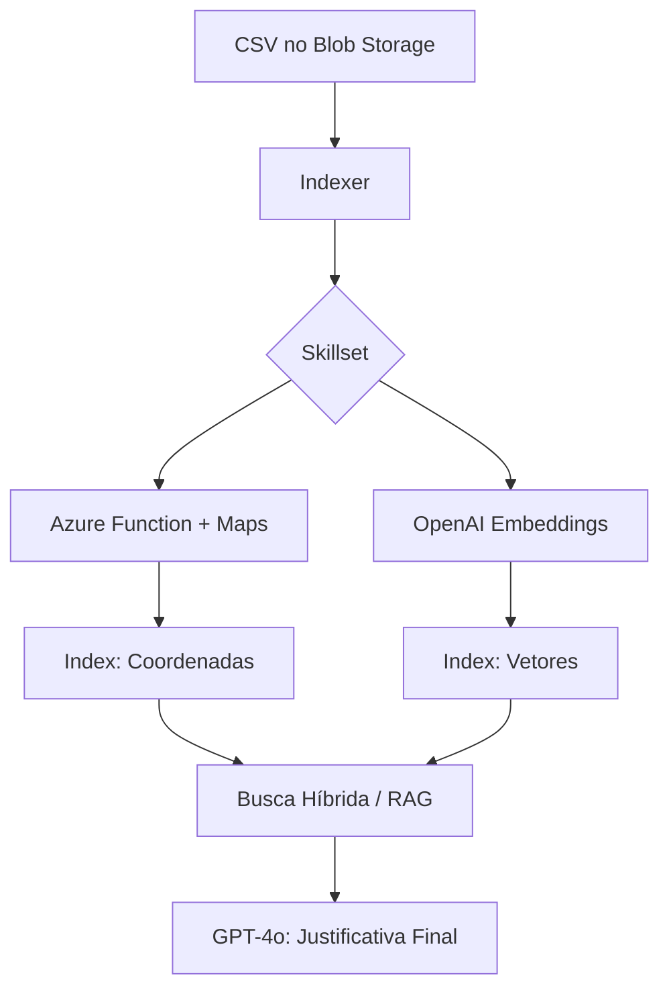

# Azure Smart Staffing RAG 🛡️


Sistema Inteligente de Alocação de Vigilantes utilizando arquitetura **RAG (Retrieval-Augmented Generation)**. O projeto combina busca vetorial, filtros geoespaciais e inteligência generativa para otimizar a logística de substituição de postos de segurança armada.

## 🚀 O Problema e a Solução

A realocação de vigilantes é um desafio crítico que envolve:

1. **Compliance PF:** O profissional precisa estar com a reciclagem em dia.
2. **Logística:** O custo de deslocamento deve ser minimizado.
3. **Fit Comportamental:** O perfil (Soft Skills) deve ser adequado ao tipo de posto (Ex: Escolar vs. Bancário).

Este sistema utiliza **AI Enrichment** para converter endereços brutos em coordenadas e **Vector Embeddings** para analisar perfis comportamentais, entregando ao gestor uma lista de candidatos ideais com justificativas geradas por GPT-4o.

---

## 🏗️ Arquitetura do Sistema

A arquitetura foi desenhada para ser escalável e segura, utilizando o padrão *Identity-First* (sem chaves expostas).

## A. Fluxo de Dados (Data Pipeline)

1. **Ingestão**: Arquivos CSV são depositados no **Azure Blob Storage**.
2. **Enriquecimento (AI Pipeline)**:
* O **Azure AI Search Indexer** dispara chamadas para uma **Azure Function**.
* A Function consome o **Azure Maps** para transformar CEP em `Edm.GeographyPoint`.
* O **Azure OpenAI** (`text-embedding-3-small`) converte o perfil comportamental em vetores de 1536 dimensões.
3. **Persistência**: Os dados enriquecidos são armazenados no **Vector Store**.



## B. Orquestração e Runtime (Kubernetes):
* A aplicação **FastAPI** é executada em **Azure Kubernetes Service (AKS)**, utilizando manifestos de **Deployment** para garantir alta disponibilidade.
* A segurança é garantida via **Workload Identity**, permitindo que o Pod se autentique nos serviços de IA sem chaves de API.

## C. Processo RAG Inteligente (LangChain):
* O **LangChain** atua como o motor de orquestração:
* **Retrieval:** Realiza a Busca Híbrida no **AI Search** aplicando filtros de compliance (Reciclagem), geolocalização (Geo-filtering) e relevância (Busca Vetorial por Soft Skills).
* **Augmentation:** Monta um prompt contextualizado injetando o perfil dos candidatos encontrados.
* **Generation:** O **GPT-4o** gera uma justificativa humanizada, comparando as Soft Skills do colaborador com os requisitos do posto (ex: "Perfil comunicativo ideal para posto escolar").

---

## 🛠️ Stack Tecnológica

* **Linguagem:** Python 3.11+
* **Framework:** FastAPI & LangChain
* **IA Generativa:** Azure OpenAI (GPT-4o & Text-Embeddings)
* **Busca Inteligente**: Azure AI Search (Hybrid Search, Skillsets & Scoring Profiles)
* **Infraestrutura:** Terraform (Modular Design) & Kubernetes (AKS)
* **Segurança:** Azure RBAC (Managed Identities) & Private Endpoints
* **CI/CD:** GitHub Actions
* **Dados:** Azure Blob Storage & Azure Functions (Event-Driven Ingestion)

---

## 🗺️ Roadmap de Desenvolvimento

### 1. Criação do Dataset

* [x] **Setup de Gerador Sintético:** Script Python utilizando biblioteca `Faker` para criação de massa de dados.
* [x] **Compliance LGPD (Data Masking):** Implementação de máscara em campos sensíveis (CPF: `785.***.***-30`) para proteção de PII.
* [x] **Dicionário de Dados:** Definição de atributos críticos (Certificações, Reciclagem PF, Soft Skills e CEP).
* [x] **Cenários de Teste:** Geração de arquivos `base_vigilantes_ativos.csv` e `escala_atual.csv`.

### 2. Infraestrutura como Código (Terraform Modular)

* [x] **Setup de Provedores:** Configuração do Azure Provider e Backend Remoto para `.tfstate`.
* [x] **Módulo de Cluster:** Provisionamento do **Azure Kubernetes Service (AKS)** e Container Registry (ACR).
* [x] **Módulo de Storage:** Provisionamento de Blob Storage e Containers de Ingestão (`rh-uploads`).
* [x] **Módulo de IA:** Deployment do Azure OpenAI e Azure AI Search (SKU Standard).
* [x] **Módulo de Networking:** Configuração de VNet e isolamento de rede.
* [x] **Segurança RBAC:** Implementação de Managed Identities para acesso passwordless.
* [x] **Módulo de Serverless:** Provisionamento de **Azure Functions** para pipeline de enriquecimento.

### 3. Ingestão e Enriquecimento (AI Pipeline)

* [x] **Azure Function (Custom Skill):** Desenvolvimento de API Serverless para geocodificação (CEP -> Lat/Long) seguindo o contrato de interface do AI Search.
* [x] **AI Search Skillset:** Configuração do pipeline de enriquecimento que orquestra a chamada da Function e a extração de metadados.
* [x] **Index Design (Geospatial & Vector):** Configuração de campos `Edm.GeographyPoint` para busca por proximidade e `Collection(Single)` para busca vetorial de Soft Skills.
* [x] **Indexer & DataSource:** Automação da varredura do Blob Storage (`rh-uploads`) para sincronização e vetorização automática de novos perfis.

### 4. Engine RAG & API (FastAPI & LangChain)

* [ ] **Containerização:** Criação de Dockerfile multi-stage para otimização de imagem da API.
* [ ] **Kubernetes Manifests:** Configuração de Deployments e Services.
* [ ] **Orquestração com LangChain:** Implementação de **Chains** para fluxo Pergunta -> Retrieval -> Prompt -> GPT-4o.
* [ ] **Retrieval Strategy:** Implementação de **Busca Híbrida** (Vetorial + Keyword) e Re-ranking semântico.
* [ ] **Setup de API (FastAPI):** Endpoints para solicitação de substituição e integração com Workload Identity.

### 5. Automação, DevOps & Observabilidade

* [ ] **ConfigMaps & Secrets:** Injeção de variáveis de ambiente seguras via Kubernetes.
* [ ] **CI Pipeline:** Automação de Linting, Docker Build e Push para o ACR via GitHub Actions.
* [ ] **CD Pipeline:** Deploy automatizado no AKS (GitOps approach).
* [ ] **IaC Pipeline:** Automação do ciclo de vida da infraestrutura via Terraform.

---

## 🛠️ Guia de Configuração da Infraestrutura (Início Rápido)

Este guia detalha como subir toda a infraestrutura na Azure utilizando Terraform.

### 1. Pré-requisitos
* **Azure CLI** instalado e logado (`az login`).
* **Terraform** (v1.0+) instalado.
* **Azure Functions Core Tools** instalado (para deploy/teste da Custom Skill).
* **Docker Desktop** rodando.
* **Assinatura Azure** ativa.
* **Python 3.11+** configurado.

### 2. Passo a Passo Inicial

#### A. Bootstrap (Preparação do Cofre)
O Terraform precisa de um lugar seguro para guardar o estado da sua infraestrutura. Execute o script de automação inicial:

```bash
chmod +x bootstrap.sh
./bootstrap.sh
```

*Este script criará um Resource Group chamado `rg-terraform-state`. **Anote o nome da Storage Account gerada no final.***

#### B. Configuração do Backend
Abra o arquivo `terraform/main.tf` e atualize o bloco `backend "azurerm"` com o nome da Storage Account gerada:

```hcl
backend "azurerm" {
  resource_group_name  = "rg-terraform-state"
  storage_account_name = "ST_GERADA_AQUI"
  container_name       = "tfstate"
  key                  = "smart-staffing.terraform.tfstate"
}
```

#### C. Provisionamento (Deploy)
Agora, dispare a criação de todos os recursos:

```bash
cd terraform
terraform init
terraform plan
terraform apply -auto-approve
```


### D. Extração de Credenciais (Pós-Deploy)

Após o `terraform apply`, você pode recuperar as chaves e endpoints necessários para o seu arquivo `.env` utilizando a Azure CLI. Execute os comandos abaixo no terminal:

```bash
# 1. Credenciais do Azure AI Search
export SEARCH_ENDPOINT=$(terraform output -raw search_endpoint)
export SEARCH_KEY=$(az search admin-key show --resource-group rg-smart-staffing --service-name srch-smart-staffing-prod2 --query "primaryKey" --output tsv)

# 2. Credenciais do Azure OpenAI
export OPENAI_ENDPOINT=$(terraform output -raw openai_endpoint)
export OPENAI_KEY=$(az cognitiveservices account keys list --name oai-smart-staffing --resource-group rg-smart-staffing --query "key1" --output tsv)

# 3. Credenciais da Azure Function (Geocoding)
export FUNC_URL=$(terraform output -raw function_url)
export FUNC_KEY=$(az functionapp keys list --name func-geocoding-staffing --resource-group rg-smart-staffing --query "functionKeys.default" --output tsv)

# Print para conferência (ou use para redirecionar para o .env)
echo -e "AZURE_SEARCH_ENDPOINT=$SEARCH_ENDPOINT\nAZURE_SEARCH_KEY=$SEARCH_KEY\nAZURE_OPENAI_ENDPOINT=$OPENAI_ENDPOINT\nAZURE_OPENAI_KEY=$OPENAI_KEY\nGEO_FUNCTION_URL=$FUNC_URL\nGEO_FUNCTION_KEY=$FUNC_KEY"

```

## 🛠️ Guia de Execução Local

#### 1. Deploy da Custom Skill (Azure Function)

O Azure AI Search depende desta função para enriquecer os dados.

```bash
cd azure_functions
func azure functionapp publish func-geocoding-staffing

```

### 2. Geração da Massa de Dados

```bash
python -m venv venv
source venv/bin/activate  # venv\Scripts\activate no Windows
pip install -r requirements.txt
python scripts/data_generator.py
```

### 3. Configuração do Ambiente (.env)

Crie um arquivo `.env` na raiz do projeto para que os scripts de sincronização e a API possam se autenticar nos serviços provisionados:

```bash
AZURE_SEARCH_ENDPOINT="https://srch-smart-staffing-prod2.search.windows.net"
AZURE_SEARCH_KEY="Sua_Admin_Key_Aqui"
AZURE_OPENAI_ENDPOINT="Seu_Endpoint_OpenAI"
AZURE_OPENAI_KEY="Sua_Chave_OpenAI"
GEO_FUNCTION_URL="Url_da_sua_Function"
GEO_FUNCTION_KEY="Chave_da_sua_Function"

```

### 4. Sincronização do AI Search Pipeline

Com a infraestrutura pronta e as variáveis configuradas, rode o script de sincronização para criar o Índice, o Skillset e o Indexador:

```bash
# Sincroniza as definições JSON locais com a Azure
python scripts/sync_search.py

```

### 5. Gatilho do Indexador e Validação

Após a sincronização, o indexador iniciará o processamento dos 400 documentos (IA Enrichment + Geocoding). Para validar se os dados foram indexados corretamente (contornando caches de interface do portal), execute:

```bash
# Teste via CLI (Substitua [KEY] pela sua Admin Key)
curl -X GET "https://srch-smart-staffing-prod2.search.windows.net/indexes/vigilantes-index/docs?search=*&\$top=5&api-version=2024-07-01" \
  -H "Content-Type: application/json" \
  -H "api-key: [AZURE_SEARCH_ADMIN_KEY]"

```

---

## 🔐 Segurança e Compliance

* **Zero Trust:** Comunicação entre AKS, Functions e Serviços de IA via **Managed Identities**.
* **Isolamento:** Uso de Private Endpoints para garantir que o tráfego de dados não transite pela internet pública.
* **LGPD:** Mascaramento de dados sensíveis na camada de geração de dataset sintético.

---

## 📁 Estrutura do Repositório

```text
├── terraform/            # Módulos de Infraestrutura
├── azure_functions/      # Custom Skills (Geocoding)
├── scripts/              # Sync Scripts e Gerador de Dados
├── search_assets/        # Definições JSON (Index, Skillset, Indexer)
├── app/                  # Engine RAG (FastAPI + LangChain)
└── README.md
```
